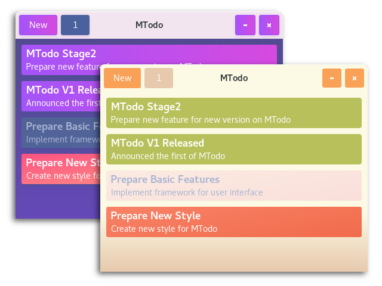

<div align="center">
     <p style="text-align:center"><h2>MTodo</h2></p>
     <p style="text-align:center">Simple Todo Software For GNU/Linux</p>
     
</div>

### Install

```
$ wget https://github.com/Mortezaipo/MTodo/archive/v1.0.0.tar.gz
$ mkdir /opt/mtodo/ && tar xzf v1.0.0.tar.gz -C /opt/mtodo/ --strip-components 1
$ /opt/mtodo/bin/mtodo
```

Desktop file (save to ~/.local/share/applications/mtodo.desktop):

```
[Desktop Entry]
Version=1.0
Type=Application
Name=MTodo
Icon=/opt/mtodo/mtodo.png
Exec=/opt/mtodo/bin/mtodo
Comment=Simple Todo management
Categories=utility
Terminal=false
```

### Document
Please check the <a href="https://github.com/Mortezaipo/MTodo/wiki">wiki</a> page.

### Next Versions
In the next version, these features will be implemented:
* Multi-level sub tasks
* Multi-level sub projects
* Notifications (API invoke)
* Intuitive dates
* Support cron jobs
* Reminders
* Integrate with other systems
* Set priorities
* Set color (gradient theme) on tasks, projects and label
* Markdown support
* Comments on tasks
* Labels and filters
* Media support
* GTK custom themes
* Encrypt user data / authentication support

### Contribute
Please create issues on Github to report bugs, send feature requests and so on. If you've developed good git commits after forking on Github, then please create pull requests in order to request a review and merge you commits.

### License
GNU GENERAL PUBLIC LICENSE Version 3 (GNU GPLv3)

<br>
<strong>Icon owner:<strong> http://laurareen.com/ <br>
<strong>Icon license:</strong> https://creativecommons.org/licenses/by/3.0/ <br>
<strong>Colors: </strong> https://dribbble.com/
