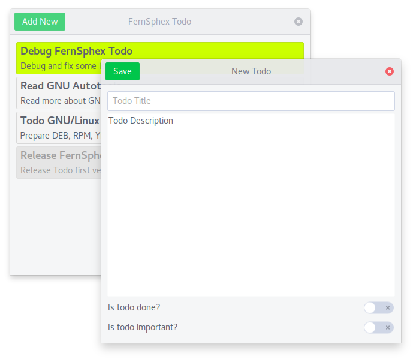

# Todo

Todo Tracking Software

    

Developed in C and GTK+ 3.

**Under Construction ....**

##Features:
| Feature | Version | Status |
| --- | --- | --- |
| Todo management                | 1.0 | Done           |
| Support multi user             | 1.0 | Done           |
| Mark todo as Done or Important | 1.0 | Done           |
| Choice a color for todo        | 1.0 | In Development |
| Support rich text              | 1.0 | In Development |
| Support i18n                   | 1.0 | In Development |
| Support tray icon              | 1.0 | In Development |
| Support Gnome dark/light theme | 1.0 | In Development |
| Avoid to open several process  | 1.0 | In Development |
| Linux packages                 | all | In Development |

##How to Contribute
Please **create issues on Github** to report bugs, send feature requests and so on.
If you've developed good git commits after forking FernSphex Todo on Github,
then please **create pull requests** in order to request a review and merge you commits.

##License:
GNU GENERAL PUBLIC LICENSE Version 3 (GNU GPLv3)

Icon owner: http://laurareen.com/

Icon license: https://creativecommons.org/licenses/by/3.0/
